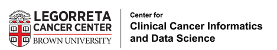

---
---

# Fisk Lab @ URI
## Please bear with us as the lab website is under-construction!
The Fisk Lab is a dry-lab at the University of Rhode Island with two distinct arms:
### Translational Bioinformatics
This arm of the lab focuses on using "basic science" methods from evolution, population genetics, genomics, and bioinformatics as tools for translational research, particularly in cancer systems. The lab also works in collaboration with labs studying other systems, such as the marine systems often studied at URI, and assists in statistical analysis, experimental design, and data analysis with myriad collaborators. 

### Discipline-Based Education Research
This arm centers the study and improvement of education in discipline-specific ways (e.g., how do we better teach programming to biologists?, in what ways do structural barriers uniquely affect underrepresented students studying computational biology?, etc). The lab is also broadly interested in advancing pluralistic but nonetheless evidence-based modes of teaching and learning.

## Affiliations
The Fisk lab is located at the University of Rhode Island, where the PI (Assistant Professor Nic Fisk) is appointed.

Fisk is a member of the [Brown/Lifespan Center for Clinical Cancer Informatics and Data Science](https://sites.brown.edu/ccids/).

Fisk is also a sponsored entity of and friend to the [Townsend Lab](https://medicine.yale.edu/lab/townsend/) at Yale University.



## Highlights


We use computational biology to investigate the progression of human disease, especially cancer.









We work on a broad swath of projects both in the translational biosciences and in Discipline-Based Education Research.









The Fisk Lab is new--we have many collaborators, but no teammembers--yet! Feel free to reach out if you're interested in joining the team.






